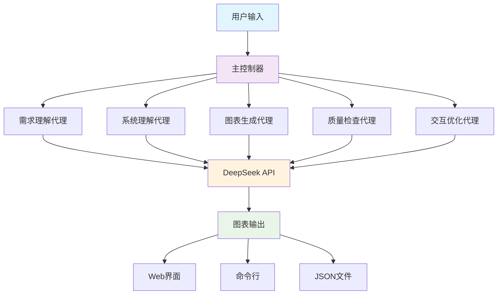
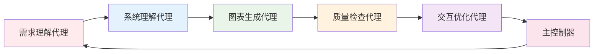
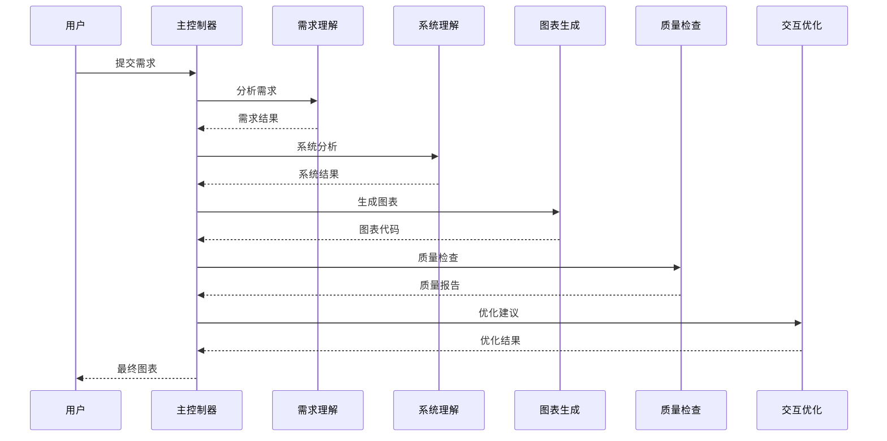

# 🤖 系统图表绘制代理

基于 DeepSeek API 的智能系统图表生成工具，能够自动理解用户需求并生成多种类型的专业图表。

[](https://python.org)
[](LICENSE)
[](https://deepseek.com)

## 🌟 项目特色

- **🧠 智能理解**: 自动分析用户需求，识别最适合的图表类型
- **📊 多图表支持**: 支持9种专业图表类型，满足不同场景需求
- **🔄 自动优化**: 内置质量检查和自动修复机制
- **🌐 多种接口**: 支持命令行、Web界面和交互式模式
- **⚡ 高性能**: 异步处理，支持并发会话管理
- **🎯 个性化**: 学习用户偏好，提供个性化建议

## 📋 支持的图表类型

| 图表类型 | 描述 | 适用场景 |
|---------|------|----------|
| 🔄 流程图 | 业务流程和逻辑流程 | 业务分析、流程设计 |
| 🏗️ 系统架构图 | 系统组件和架构设计 | 技术架构、系统设计 |
| 📊 E-R图 | 数据库实体关系 | 数据库设计、数据建模 |
| 🎯 UML类图 | 面向对象设计 | 软件设计、代码架构 |
| 👤 UML用例图 | 用户交互场景 | 需求分析、功能设计 |
| ⏰ 时序图 | 时间序列交互 | 接口设计、交互流程 |
| 🎬 活动图 | 活动和决策流程 | 业务流程、算法设计 |
| 🤝 协作图 | 对象间协作关系 | 系统交互、组件协作 |
| 🌳 功能结构图 | 功能层次结构 | 功能分解、模块设计 |

## 🏗️ 系统架构



## 🔧 核心组件

### 🎯 六大智能代理



1. **需求理解代理** - 分析用户输入，识别图表类型和关键要素
2. **系统理解代理** - 深度理解系统架构和业务逻辑
3. **图表生成代理** - 生成高质量的Mermaid图表代码
4. **质量检查代理** - 多维度质量评估和自动修复
5. **交互优化代理** - 个性化建议和用户体验优化
6. **主控制器** - 协调各代理，管理处理流程

### 📊 处理流程



## 🚀 快速开始

### 📦 安装依赖

```bash

cd system-diagram-agent

# 安装依赖
pip install -r requirements.txt

# 配置环境变量
cp env.example .env
# 编辑 .env 文件，设置您的 DEEPSEEK_API_KEY
```


### 🎮 使用方式

#### 1. 交互模式（推荐新手）
```bash
python main.py interactive
```

#### 2. 命令行模式
```bash
python main.py cli "设计用户登录系统的流程图"
```

#### 3. Web界面模式
```bash
python main.py web
# 访问 http://localhost:5000
```

#### 4. 健康检查
```bash
python main.py health
```

## 🌐 Web界面预览

Web界面提供直观的图表生成体验：

- **📝 智能输入框** - 自然语言描述需求
- **⚙️ 个性化设置** - 调整生成参数和偏好
- **📊 实时预览** - Mermaid图表实时渲染
- **💾 导出功能** - 支持多种格式导出
- **📚 示例库** - 丰富的示例模板

## 📁 项目结构

```
system-diagram-agent/
├── 📁 agents/              # 智能代理模块
│   ├── base_agent.py       # 基础代理抽象类
│   ├── requirement_agent.py # 需求理解代理
│   ├── system_agent.py     # 系统理解代理
│   ├── diagram_agent.py    # 图表生成代理
│   ├── quality_agent.py    # 质量检查代理
│   ├── interaction_agent.py # 交互优化代理
│   └── main_controller.py  # 主控制器
├── 📁 api/                 # API客户端
│   └── deepseek_client.py  # DeepSeek API客户端
├── 📁 prompts/             # 提示词模板
│   └── prompt_templates.py # 提示词管理
├── 📁 utils/               # 工具模块
│   ├── logger.py           # 日志管理
│   └── validators.py       # 数据验证
├── 📁 web/                 # Web界面
│   ├── app.py              # Flask应用
│   └── templates/          # HTML模板
├── 📁 logs/                # 日志文件
├── config.py               # 配置管理
├── main.py                 # 主入口
├── quick_start.py          # 快速启动
├── test_example.py         # 功能测试
└── requirements.txt        # 依赖列表
```

## ⚙️ 配置选项

### 🔑 环境变量

| 变量名 | 类型 | 默认值 | 说明 |
|--------|------|--------|------|
| `DEEPSEEK_API_KEY` | string | - | DeepSeek API密钥（必填） |
| `DEEPSEEK_BASE_URL` | string | https://api.deepseek.com/v1 | API基础URL |
| `DEEPSEEK_MODEL` | string | deepseek-chat | 模型名称 |
| `LOG_LEVEL` | string | INFO | 日志级别 |
| `WEB_HOST` | string | localhost | Web服务地址 |
| `WEB_PORT` | int | 5000 | Web服务端口 |
| `MAX_CONCURRENT_SESSIONS` | int | 10 | 最大并发会话数 |

### 🎛️ 高级配置

```python
# 控制器配置
controller_config = ControllerConfig(
    max_concurrent_sessions=20,    # 并发会话数
    auto_quality_check=True,       # 自动质量检查
    auto_fix_diagrams=True,        # 自动修复图表
    enable_interaction_optimization=True  # 启用交互优化
)
```

## 📊 质量保证

### 🔍 五维质量评估

```mermaid
radar
    title 图表质量评估维度
    "语法正确性" : 0.9
    "逻辑完整性" : 0.85
    "视觉清晰度" : 0.8
    "信息准确性" : 0.9
    "用户友好性" : 0.75
```

- **语法正确性** - Mermaid语法验证
- **逻辑完整性** - 图表逻辑结构检查
- **视觉清晰度** - 布局和可读性评估
- **信息准确性** - 内容与需求匹配度
- **用户友好性** - 易理解和易使用程度

### 🔧 自动修复机制

- **语法错误修复** - 自动纠正Mermaid语法问题
- **布局优化** - 改善图表布局和连接
- **标签规范化** - 统一命名和标签格式
- **冗余清理** - 移除重复和无用元素

## 🧪 测试与验证

### 🏃‍♂️ 运行测试

```bash
# 完整功能测试
python test_example.py

# 健康检查
python main.py health

# 快速验证
python quick_start.py
```

### 📈 性能指标

- **响应时间**: < 10秒（单图表）
- **并发支持**: 10个并发会话
- **成功率**: > 95%
- **质量分数**: 平均 85+/100

## 🔧 开发指南

### 🏗️ 扩展新图表类型

1. 在 `utils/validators.py` 中添加图表类型
2. 在 `prompts/prompt_templates.py` 中添加提示词
3. 在 `agents/diagram_agent.py` 中实现生成逻辑
4. 更新质量检查规则

### 🎨 自定义代理

```python
from agents.base_agent import BaseAgent

class CustomAgent(BaseAgent):
    def process(self, input_data, context=None):
        # 实现自定义逻辑
        result = self._make_api_call(prompt)
        return self.format_output(result)
```


## 📄 许可证

本项目采用 MIT 许可证 - 查看 [LICENSE](LICENSE) 文件了解详情

## 🙏 致谢

- [DeepSeek](https://deepseek.com) - 提供强大的AI模型支持
- [Mermaid](https://mermaid-js.github.io/) - 优秀的图表渲染引擎
- [Flask](https://flask.palletsprojects.com/) - 轻量级Web框架
- [Rich](https://rich.readthedocs.io/) - 美观的终端输出
